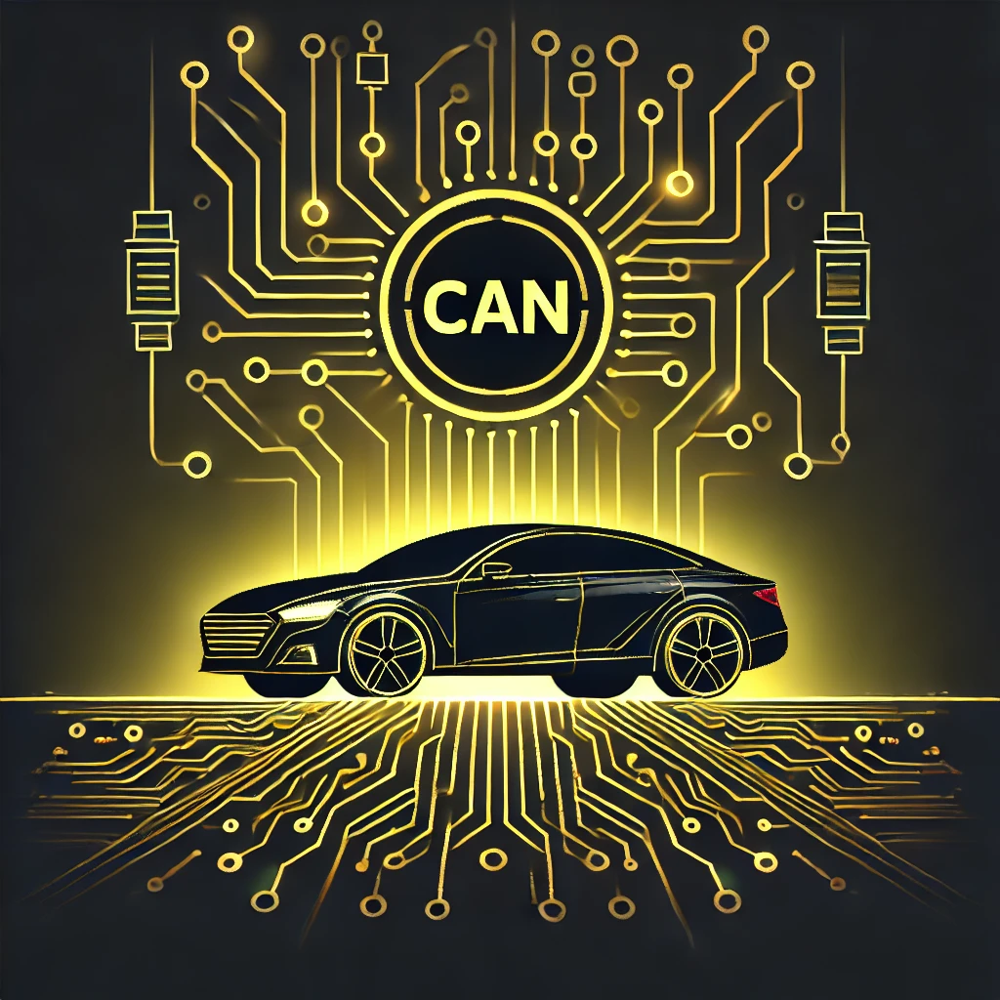
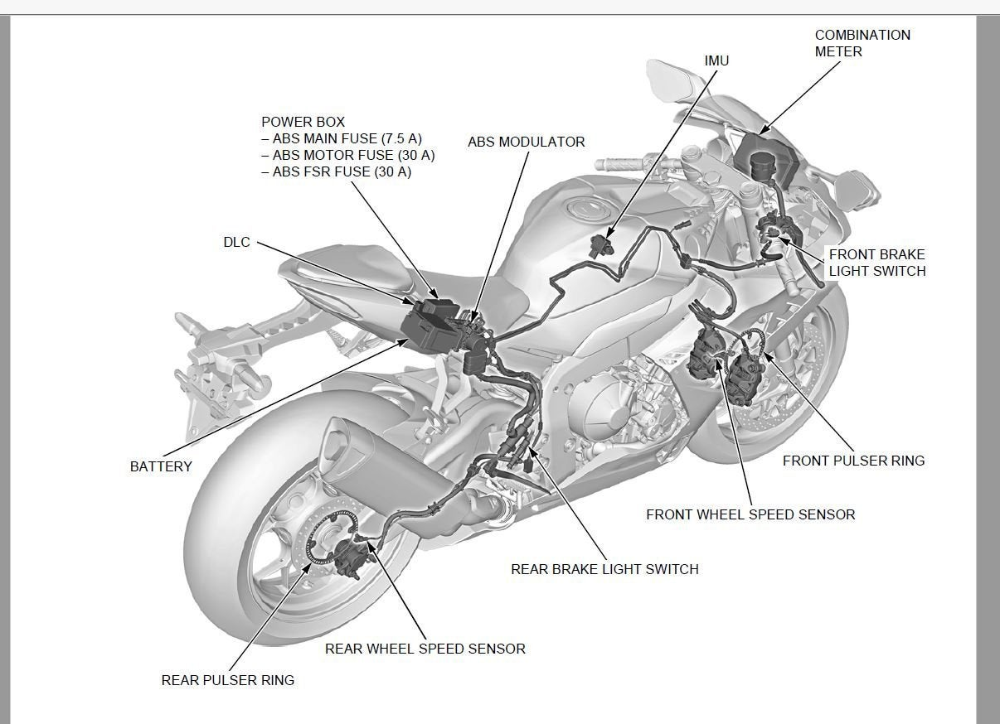
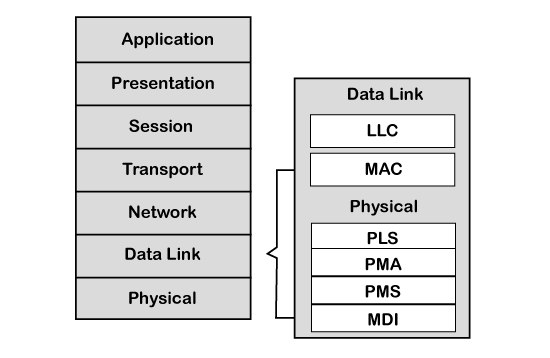
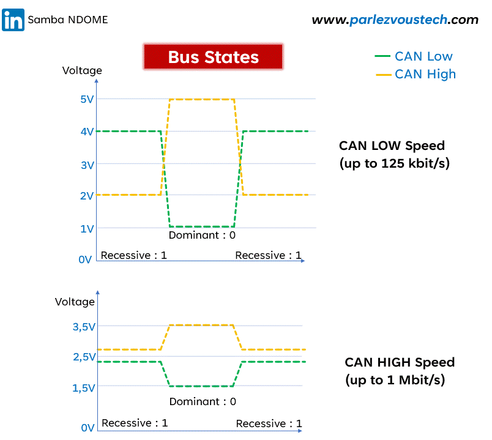

# CAN

Overview: CAN (Controller Area Network) là một giao thức truyền thông tiêu chuẩn trong ngành ô tô, cho phép các Electronic Control Units (ECUs) giao tiếp hiệu quả mà không cần máy chủ trung tâm. CAN nổi bật với tính tin cậy cao, khả năng phát hiện và sửa lỗi mạnh mẽ, cũng như khả năng mở rộng cho nhiều thiết bị trên cùng một mạng. Nó ứng dụng rộng rãi từ hệ thống điều khiển động cơ đến các chức năng an toàn như phanh ABS và túi khí. 
Created time: October 18, 2024 2:36 PM
Last edited time: April 7, 2025 11:18 PM
Topic: CAN

**CAN (Controller Area Network)** là một giao thức truyền thông tiêu chuẩn trong ngành ô tô, cho phép các **Electronic Control Units (ECUs)** giao tiếp hiệu quả mà không cần máy chủ trung tâm. CAN nổi bật với tính tin cậy cao, khả năng phát hiện và sửa lỗi mạnh mẽ, cũng như khả năng mở rộng cho nhiều thiết bị trên cùng một mạng. Nó ứng dụng rộng rãi từ hệ thống điều khiển động cơ đến các chức năng an toàn như phanh ABS và túi khí. Bài viết này sẽ khám phá các khía cạnh khác nhau của CAN, từ nguyên lý hoạt động đến các ứng dụng trong ô tô, xe motor. Cùng nhau tìm hiểu nhé 😀

## Giới thiệu:

Một số thiết bị giao tiếp với nhau qua đường CAN bus như: ABS(Anti-lock Breaking System), IMU(Initial Measurement Unit), Combination Meter,  ECU(Engineer control unit),..Error Frame Format

(ECU - Sensor có thể có những giao tiếp khác nhau, nhưng ECU - ECU thường giao tiếp qua CAN)

Minh họa hệ thống ABS của CBR1000RR

## **CAN layered architecture**

Như chúng ta biết rằng [mô hình OSI](https://www.javatpoint.com/osi-model) phân vùng hệ thống truyền thông thành 7 lớp khác nhau. Nhưng kiến trúc phân lớp CAN bao gồm hai lớp, tức là [Data Link Layer](https://www.javatpoint.com/data-link-layer) (lớp liên kết dữ liệu) và [Physical Layer](https://www.javatpoint.com/physical-layer-in-osi-model) (lớp vật lý)

## CAN system

- CANH: CAN High line
- CANL: CAN Low line
- Rt: Termination (120 ohm) - Nếu muốn truyền đi xa

Mỗi cục ECU được xem là một CAN Node

CAN transceiver thường là một microcontroller rời để chuyển VD MCP2551

# Basic concept:

## Logic States (Trạng Thái Logic)

Trong mạng CAN, có hai trạng thái logic chính để biểu diễn dữ liệu trên bus, theo tần số lấy mẫu bit rate 500 Kbit/s (tùy config)

- **Dominant (Thống trị)**: Logic `0`
    - Khi một thiết bị trên mạng phát ra trạng thái dominant, tất cả các thiết bị khác trên bus sẽ thấy trạng thái đó.
    - Điện áp trên bus sẽ khác nhau tùy thuộc vào mức độ phân cực của dây CAN-H (cao) và CAN-L (thấp), thường là khoảng 3.5V trên CAN-H và 1.5V trên CAN-L.
- **Recessive (Bị động)**: Logic `1`
    - Nếu không có thiết bị nào trên mạng phát ra trạng thái dominant, bus sẽ ở trạng thái recessive.
    - Điện áp trên cả hai dây CAN-H và CAN-L đều sẽ xấp xỉ 2.5V, cho thấy rằng không có xung đột xảy ra.

Sự phân biệt giữa trạng thái dominant và recessive cho phép mạng CAN thực hiện cơ chế **Arbitration** và kiểm soát bus hiệu quả.

*Giả sử: Nếu có 3 node cùng gửi ra CAN frame đồng thời, nhưng chỉ có 1 đường physical để truyền thì mình sẽ ưu tiên gửi của node nào?*

## Arbitration (Tranh Chấp Quyền Truy Cập → Độ ưu tiên)

Arbitration là quá trình xác định thiết bị nào được quyền gửi dữ liệu khi có nhiều thiết bị cùng muốn truyền thông tin trên bus CAN. Cơ chế này giúp đảm bảo dữ liệu có độ ưu tiên cao sẽ được truyền đi trước.

- **Quá trình Arbitration**:
    1. Khi có nhiều Node muốn truyền dữ liệu cùng lúc, tất cả đều bắt đầu transfer các bit của ID Frame message.
    2. Arbitration diễn ra từng bit một, dựa trên nguyên tắc:
        - Nếu một thiết bị phát ra bit recessive (`1`) nhưng lại nhận được bit dominant (`0`), thiết bị đó sẽ ngừng phát và đợi cho đến khi bus rảnh để phát lại sau.
        - Thiết bị có ID với giá trị thấp nhất (ưu tiên cao hơn) sẽ tiếp tục phát mà không bị ngừng lại.→ “Smaller the message identifier, higher the message priority”
    3. Quá trình này tiếp tục cho đến khi chỉ còn lại một thiết bị, thiết bị này sẽ được quyền phát thông điệp lên bus.
- **Tại sao Arbitration quan trọng?**:
    - Giúp đảm bảo rằng các thông điệp có độ ưu tiên cao sẽ được xử lý trước, ví dụ như các thông điệp liên quan đến an toàn trên xe hơi (ABS, túi khí).
    - Arbitration diễn ra mà không làm mất dữ liệu, do không có xung đột dữ liệu thực sự.

## Bit Segmentation

Mỗi bit trong CAN được chia thành 4 segment:

| *Segment* | *Chức năng chính* |
| --- | --- |
| **Synchronization Segment** | Tx đặt giá trị bit (dominant hoặc recessive) lên bus khi có edge chuyển đổi (1 → 0 hoặc 0 → 1). |
| **Propagation Segment** | Dùng để **bù trừ propagation delay** giữa các node (ví dụ: từ Node A đến Node B). |
| **Phase Segment 1** | Một phần trong tính toán sampling point. |
| **Phase Segment 2** | Phần còn lại trong tính toán sampling point. |

**Sampling Point** là điểm mà các Rx node sẽ đọc giá trị bit từ bus. Sampling xảy ra ở ranh giới giữa Phase 1 và Phase 2.

### Propagation Delay là gì? Thời điểm truyền và lấy mẫu bit

- Giả sử Node A là **Tx**, Node B là **Rx**.
- Node A đặt dominant bit (0) lên bus tại **Sync Segment**.
- Bus thay đổi từ 1 → 0, edge này mất **một khoảng thời gian** mới đến được Node B ⇒ **đó là propagation delay** (`t_prop A→B`).

Nếu không có `Propagation Segment`, Node B có thể **sample sai bit** (ví dụ: vẫn thấy recessive = 1), do chưa nhận kịp dominant bit từ Node A.

**Giải pháp:** Thêm **Propagation Segment** đủ dài để đảm bảo mọi Rx node đều nhận được bit **trước khi sampling**.

**Rule:** `Propagation Segment ≥ max(t_AB)` giữa các node xa nhất trên bus.

### Trường hợp 2 node Tx cùng lúc (unsynchronized)

- Node A và Node B cùng gửi bit tại thời điểm khác nhau do chưa đồng bộ.
- Cả hai đều đưa bit lên bus trong Sync Segment của chúng, và edge truyền đi với delay.
- Miễn là **Propagation Segment đủ lớn**, cả hai node sẽ nhận ra bit của nhau **trước sampling point**, đảm bảo tất cả node đều đồng nhất về bit đọc được trên bus.

💡 Việc này giúp tránh xung đột bit khi arbitration xảy ra (nội dung sẽ ở bài sau).

### Bit Monitoring là gì?

- Mỗi Tx node **phải kiểm tra lại bus** sau khi gửi bit để đảm bảo bus phản ánh đúng giá trị đã gửi.

Ví dụ:

- Nếu gửi **dominant (0)** → kiểm tra bus có phải cũng là 0 không.
- Nếu gửi **recessive (1)** → kiểm tra bus có phải vẫn là 1 không.

Nếu khác nhau ⇒ xảy ra lỗi, gọi là **bit error**.

Bit Monitoring cực kỳ quan trọng trong việc phát hiện lỗi và **arbitration** (ưu tiên truy cập bus giữa các node).

---

# CAN Frame:

Có 4 loại frame khi tuyền data trong mạng CAN:

## **I. Data frame** (Khung Dữ Liệu)

Đây là khung message chính dùng để truyền dữ liệu giữa các ECU

1. **Start of Frame (SOF)**

- Là một bit dominant (`0`) dùng để báo hiệu bắt đầu của khung dữ liệu. Tất cả các thiết bị trên mạng sẽ đồng bộ hóa với tín hiệu này để bắt đầu nhận dữ liệu.

2. **Identifier (ID)** 

- Xác định độ ưu tiên của khung dữ liệu. Giá trị ID càng thấp thì mức độ ưu tiên càng cao, và khung đó sẽ giành quyền truyền trước trong quá trình arbitration.
- Có hai loại định dạng: (chúng chỉ khác về address → còn nhiều address thì support càng nhiều CAN ID)
    - **Standard Frame Format (11-bit identifier)**: Sử dụng 11 bit để xác định ID.
    - **Extended Frame Format (29-bit identifier)**: Sử dụng 29 bit để xác định ID, gồm 11 bit gốc và thêm 18 bit mở rộng.
    
    ---
    
    ***Tại sao có 2 loại?***
    
    - Ban đầu, CAN chỉ hỗ trợ 11-bit ID → cho phép tối đa **2^11 = 2048** ID, nhưng thực tế chỉ sử dụng được **~512 ID** (do có 1 số bit bị giữ lại).
    - Khi ngành ô tô phát triển, **512 ID là không đủ** → cần **số lượng ID lớn hơn** → xuất hiện **29-bit ID**.
    - Để **giữ tương thích ngược**, cả 2 loại frame phải **cùng tồn tại trong 1 mạng** → Extended ID chia thành phần giống ID chuẩn + phần mở rộng.

3. **Remote Transmission Request (RTR)**

- Là bit được dùng để yêu cầu dữ liệu từ một thiết bị khác.
- Nếu là khung dữ liệu, bit RTR sẽ là dominant (`0`), còn nếu là khung yêu cầu, bit RTR sẽ là recessive (`1`).

4. **Identifier Extension (IDE)**

- Bit này xác định loại khung dữ liệu:
    - Nếu IDE là dominant (`0`), khung đang được truyền là định dạng chuẩn (11-bit).
    - Nếu IDE là recessive (`1`), khung là định dạng mở rộng (29-bit).

5. **Reserved Bits (r0, r1)**

- Dành riêng cho các ứng dụng trong tương lai, luôn được giữ ở trạng thái recessive.

6. **Data Length Code (DLC)**

- Đây là trường xác định độ dài của dữ liệu trong khung, có thể có giá trị từ 0 đến 8, tương ứng với số byte dữ liệu.

[Chi tiết **Data Length Code (DLC)** (1)](https://www.notion.so/Chi-ti-t-Data-Length-Code-DLC-1-12a940210a7580b7a20ff16154edf2fc?pvs=21)

7. **Data Field**

- Chứa dữ liệu thực sự cần truyền đi, có kích thước từ 0 đến 8 byte tùy thuộc vào giá trị của DLC.

8. **Cyclic Redundancy Check (CRC)**

- Bao gồm 15 bit dữ liệu CRC và một bit CRC delimiter. CRC giúp phát hiện các lỗi xảy ra trong quá trình truyền dữ liệu.

9. **Acknowledgment (ACK)**

- Khung ACK bao gồm 2 bit: một bit ACK slot và một bit ACK delimiter.
- Thiết bị nhận sẽ đặt bit ACK slot ở trạng thái dominant (`0`) để xác nhận đã nhận dữ liệu thành công. Nếu không có thiết bị nào đặt bit này về dominant, khung dữ liệu sẽ được truyền lại. (trên ABS project sẽ thường không cần trả lời lại)

10. **End of Frame (EOF)**

- Là một chuỗi 7 bit recessive (`1`) đánh dấu kết thúc của khung dữ liệu.

11. **Interframe Space (IFS)**

- Giai đoạn nghỉ giữa hai khung dữ liệu, đảm bảo các thiết bị có thời gian xử lý dữ liệu trước khi nhận khung mới.

## **II. Remote Frame** (Khung Yêu Cầu Dữ Liệu)

- **Chức năng**: Dùng để yêu cầu dữ liệu từ một ECU khác. Khung này không chứa dữ liệu, mà chỉ yêu cầu thiết bị đích gửi lại Data Frame tương ứng.
- **Cấu trúc chính của Remote Frame**:
    - **Start of Frame (SOF)**.
    - **Arbitration Field**: Giống như trong Data Frame, nhưng bit RTR sẽ ở trạng thái recessive (`1`)
    - **Control Field**: Gồm Data Length Code (DLC) chỉ định số byte dữ liệu mà thiết bị gửi Data Frame sẽ truyền.
    - **CRC Field** và **ACK Field** giống như trong Data Frame.
    - **End of Frame (EOF)**.
- VD: Trong ABS project, frame này rất ít dùng vì khi IG (bật khóa xe) thì data sẽ tràn ra.
    
    và bên phía DCOM cũng có dùng như tester để re-sender service.
    

---

***Thực tế hiện nay:***

- **Remote Frame gần như không còn được sử dụng nữa** trong các hệ thống CAN hiện đại. Vì cách xử lý **khác nhau giữa các controller** → không đảm bảo thống nhất.
- Nếu muốn hiểu vì sao bị loại bỏ, có thể đọc **CIA Report 8.2** (CIA = CAN in Automation consortium).
- **III. Error Frame Format** (Khung Báo Lỗi)
    
    ### 1. Các Loại Lỗi (Error Types) trong CAN
    
    
    
    CAN có các cơ chế phát hiện lỗi mạnh mẽ để đảm bảo các lỗi xảy ra trong quá trình truyền thông đều được phát hiện kịp thời. Có 5 loại lỗi chính:
    
    - **Bit Error (Lỗi Bit)**:
        - Xảy ra khi một thiết bị gửi một bit nhưng đọc lại một bit khác trên bus.
        - Node sẽ phát hiện lỗi nếu bit gửi ra khác với bit mà nó nhận lại được (ngoại trừ bit trong các trường ACK và khi đang truyền Error Frame). → **Transmitor** sẽ gửi đồng thời cũng monitor lỗi này
    - **Stuff Error (Lỗi Bit Stuffing)**:
        - Để duy trì đồng bộ trên bus, mạng CAN sử dụng kỹ thuật bit stuffing, trong đó cứ sau 5 bit liên tiếp giống nhau, một bit nghịch đảo sẽ được chèn vào.
        - Nếu không thấy bit nghịch đảo sau 5 bit giống nhau, lỗi stuffing sẽ được phát hiện.
    - **CRC Error (Lỗi CRC)**: *quan trọng*
        - CRC (Cyclic Redundancy Check) được dùng để kiểm tra tính toàn vẹn của dữ liệu.
        - Nếu giá trị CRC do thiết bị nhận tính toán không khớp với giá trị CRC trong khung dữ liệu, lỗi CRC sẽ được báo cáo.
    - **Form Error (Lỗi Định Dạng)**:
        - Xảy ra khi một trường trong khung tin nhắn (frame) không tuân theo định dạng mong đợi.
        - Ví dụ: các trường EOF, ACK delimiter, hay CRC delimiter phải là recessive, nếu chúng có giá trị dominant thì sẽ dẫn đến lỗi định dạng.
    - **Acknowledgment Error (Lỗi ACK)**:
        - Lỗi này xảy ra khi thiết bị gửi một khung dữ liệu mà không nhận được tín hiệu ACK từ bất kỳ thiết bị nào trên bus.
        - Thiết bị gửi sẽ phát hiện lỗi nếu không có thiết bị nào xác nhận đã nhận dữ liệu (bit ACK slot không được đặt về dominant).
    
    ### 2. Fault Confinement (Giới Hạn Lỗi)
    
    CAN có một cơ chế tự giới hạn lỗi rất hiệu quả →  giúp cách ly các thiết bị có lỗi và duy trì hoạt động của toàn bộ hệ thống. Có 3 trạng thái chính:
    
    
    
    
    
    **TEC** sẽ có quyền quyết định Bus Off
    
    - **Error Active**:
        
        *→ Lỗi nhẹ, CAN vẫn truyền nhận.*
        
        - Đây là trạng thái mặc định của tất cả các thiết bị khi khởi động.
        - Trong trạng thái này, thiết bị có thể phát ra **Active Error Frame** (6 bit dominant) nếu phát hiện lỗi. Node sẽ chuyển sang **Error Passive** nếu tổng số lỗi vượt quá 127.
    - **Error Passive**:
        
        → Lỗi năng hơn
        
        - Node trong trạng thái này vẫn có thể truyền và nhận dữ liệu, nhưng với quyền ưu tiên thấp hơn.
        - Node sẽ phát ra **Passive Error Frame** (6 bit recessive) thay vì Active Error Frame khi phát hiện lỗi. Nếu số lượng lỗi giảm xuống dưới 128, node sẽ quay lại trạng thái **Error Active**. Nếu số lỗi tăng lên đến 255, node sẽ chuyển sang **Bus Off**.
    - **Bus Off**:
        
        *→ CAN không truyền nhận.*
        
        - Khi tổng số lỗi vượt quá 255, thiết bị sẽ chuyển sang trạng thái **Bus Off** và tự cách ly khỏi mạng. (cấm truyền - nhận)
        - Trong trạng thái này, thiết bị sẽ không tham gia vào bất kỳ hoạt động truyền thông nào trên bus.
        - Thiết bị có thể quay lại trạng thái **Error Active** sau một số điều kiện đặt lại lỗi.
    
    ### 3. Cơ Chế Quản Lý Lỗi của CAN
    
    - **Error Counter (Bộ Đếm Lỗi)**:
        - Mỗi thiết bị trên mạng CAN có hai bộ đếm lỗi: **Transmit Error Counter (TEC)** và **Receive Error Counter (REC)**.
        - Các bộ đếm này được tăng hoặc giảm tùy theo loại lỗi phát hiện được, giúp theo dõi trạng thái lỗi của thiết bị.
    - **Quy Tắc Tăng/Giảm Bộ Đếm Lỗi**: (specific project)
        - **Transmit Error Counter (TEC)** tăng 8 đơn vị cho mỗi lỗi truyền phát hiện được, nhưng giảm 1 đơn vị cho mỗi lần truyền thành công.
        - **Receive Error Counter (REC)** tăng 1 đơn vị cho mỗi lỗi nhận phát hiện được, và giảm 1 đơn vị nếu nhận thành công một message frame.
    
    ### Kết Luận
    
    Hệ thống phát hiện và giới hạn lỗi của **CAN** giúp mạng hoạt động ổn định và đáng tin cậy ngay cả khi xảy ra lỗi. Các cơ chế như phân loại lỗi (Bit Error, Stuff Error, CRC Error, Form Error, Acknowledgment Error) và quản lý lỗi thông qua các trạng thái **Error Active, Error Passive, Bus Off** cho phép cách ly thiết bị có vấn đề, duy trì khả năng truyền thông cho các thiết bị khác trên mạng.
    
- **IV. Overload Frame**
    
    Không quan trọng, không dùng frame này cho ABS
    
    
    
    Tương đối giống Error frame, chỉ khác ở giai đoạn đầu. Nó sẽ đợi cho frame gửi xong, có tín hiệu end frame ở mức cao → Sao đó mới hiểu overload ra ngoài.
    

## **III. Error handling**

Được sử dụng khi **có lỗi xảy ra trong quá trình truyền frame (Data hoặc Remote)**.

📌 Ai gửi Error Frame?

- **Node phát hiện lỗi** (có thể là node gửi hoặc node nhận)

📌 Mục đích:

- **Hủy bỏ frame đang được truyền**, báo hiệu cho cả mạng biết có lỗi.
- Sau đó, node phát sẽ **gửi lại** frame đó.

🔸 **Cấu trúc gồm:**

- **Error Flag**: tín hiệu lỗi
- **Error Delimiter**: đánh dấu kết thúc báo lỗi
- **Interframe Space**: khoảng cách giữa các frame

👉 Lỗi có thể đến từ:

- **Transmitter error** (lỗi từ bên phát)
- **Receiver error** (lỗi từ bên nhận)

→ Sẽ học chi tiết về **các loại lỗi và cấu trúc cụ thể của Error Frame** trong phần

1. Error Frame Format (Active Error Frame)
    
    Khi lỗi sẽ gửi ra frame này (có thể là node truyền và node nhận)
    
    VD: Xét trên từng phiên diện cụ thể.
    
    - sender - gửi data ra CAN bus: ABS truyền và monitor lỗi CAN bus off
    - receiver - nhận data từ CAN bus: ABS nhận data từ meter ECU, sẽ check lỗi alive-count và check sum
2. Error Handling
    
    
    1. Bit error
    2. CRC error 
    3. Bit Stuff
    4. Form error
    5. ACK error

## IV. Overload Frame – Khung báo quá tải

Được gửi bởi **một node đang bị quá tải** khi **cần thêm thời gian xử lý frame trước đó**.

 Ví dụ:

- Một node vừa nhận Data Frame và cần thêm thời gian để xử lý dữ liệu.
- Để **trì hoãn việc truyền frame mới**, node đó sẽ **gửi một Overload Frame** lên bus.

→ Mục đích: **"xin delay"** tạm thời từ mạng CAN.

# CAN Error handling

Mục đích của giao thức **CAN** là để truyền dữ liệu từ một **node** (nút) này đến các **node** khác trong cùng một mạng.

Dữ liệu cần truyền sẽ được gộp chung với các trường liên quan đến **frame** (khung truyền) và được gửi đi theo kiểu nối tiếp, từng **bit** một.

Tất cả các **Rx node** (node nhận) cần phải nhận chính xác nội dung mà **Tx application** (ứng dụng truyền) muốn gửi. Nếu có bất kỳ sự cố nào khiến dữ liệu bị sai lệch thì đó được gọi là **CAN error**.

Lỗi có thể xảy ra tại **Tx node**, trên **CAN bus** hoặc tại **Rx node**. Giao thức **CAN** có khả năng tự phát hiện những lỗi như vậy và sẽ phát ra một **error flag** (cờ báo lỗi).

Dựa vào việc **node** nào phát hiện ra lỗi, ta sẽ phân biệt thành **Tx errors** (lỗi phía truyền) và **Rx errors** (lỗi phía nhận).

---

Khi một **node** (dù là **Tx** hay **Rx**) phát hiện ra một **CAN error**, nó sẽ ngay lập tức bắt đầu gửi một **error flag** lên **CAN bus**.

**Error flag** này được thiết kế sao cho nó sẽ phá vỡ **data frame** hiện đang có trên **bus** – tức là làm cho frame đó bị coi là không hợp lệ.

Khi thấy **error flag**, các **node** khác cũng có thể gửi **error flag** của riêng mình lên **CAN bus**, tạo nên một chuỗi cảnh báo lỗi.

Tất cả các **error flags** cùng với các **delimiters** (khoảng cách phân tách) tạo thành một **error frame** trên **bus**.

Tùy theo **node** nào là bên phát **error flag**, **error counter** (bộ đếm lỗi) tương ứng của node đó sẽ được tăng lên, nhằm theo dõi và kiểm soát **CAN error states** (trạng thái lỗi của CAN).

## Type of CAN errors

Bit Error
Acknowledgement Error
CRC Error
Stuff Error
Form Error

Bit Error and Ack Error are called Transmitter errors
These decide the TEC counter increments

CRC, Stuff and form errors are called Receiver errors
These decide the REC counter increments

**Bit Error:**

## CAN error frame format

## CAN error state

# CAN FD

### CAN FD Frame Format

Trong CAN FD, ta có **khung dữ liệu (frame)** với định dạng "tự do hơn" so với CAN cổ điển – vì vậy gọi là **flexible**. Mặc dù về mặt cấu trúc có nhiều điểm tương đồng, nhưng CAN FD bổ sung nhiều **trường (fields)** mới giúp cải thiện hiệu suất truyền dữ liệu.

### Cấu trúc một CAN FD Frame

Khung bắt đầu bằng một **Start of Frame (SOF)** – luôn là bit **dominant (0)**. Khi bus đang idle thì ở trạng thái **recessive (1)**, vì vậy SOF báo hiệu frame mới bắt đầu.

**Arbitration Field**, gồm:

- **Identifier**: ID thông điệp (11-bit hoặc 29-bit).
- Một trường đặc biệt gọi là **RRS (Remote Request Substitution)** – thay thế cho trường **RTR** cũ trong CAN thường. Trong CAN FD, **remote frame không còn được hỗ trợ**, nên RTR không còn ý nghĩa – nhưng vẫn cần có RRS để **tương thích ngược**.
    
    
    

### Control Field

- **IDE (Identifier Extension)**: xác định đây là standard ID hay extended ID.
- **r1**: bit dự trữ (reserved).
- **EDL (Extended Data Length)**: luôn là **dominant (0)** để phân biệt với frame CAN cổ điển.
- **BRS (Bit Rate Switch)**: cho phép switch sang tốc độ cao hơn trong phần dữ liệu nếu là **recessive (1)**.
- **ESI (Error State Indicator)**: nếu **dominant (0)** thì node đang ở trạng thái **error active**, còn **recessive (1)** là **error passive**.
    
    
    

---

### 🧮 DLC (Data Length Code)

- 4 bits sử dụng cho cả 2 format CAN và CAN FD
- Nhưng khác ở chỗ: **DLC > 8** thì ánh xạ đến các độ dài cụ thể:
    - DLC=9 → 12 bytes
    - DLC=10 → 16 bytes
        
        ...
        
    - DLC=15 → 64 bytes
    
    
    

---

### 📦 Data Field

- Có thể chứa tối đa **64 bytes** (thay vì chỉ 8 bytes như CAN cổ điển).
- **Stuff bits** có thể được thêm vào để đảm bảo đồng bộ hóa bit.

---

### ✅ CRC Field (Cyclic Redundancy Check)

- Dài **17 bits** nếu dữ liệu ≤ 16 bytes
- Dài **21 bits** nếu dữ liệu > 16 bytes
- Kèm theo **CRC Delimiter**

---

### 🪪 ACK và EOF

- Sau CRC là **ACK slot**, nơi các node khác xác nhận đã nhận được dữ liệu.
- Rồi đến **ACK delimiter**, **End of Frame (EOF)** với 7 bit recessive, và cuối cùng là **Intermission** (3 bit recessive).

---

### ⚡ Ưu điểm của CAN FD

- Cho phép truyền **nhiều dữ liệu hơn trong cùng thời gian** → **hiệu suất tăng mạnh**.
- Tốc độ truyền có thể **switch** trong phần dữ liệu nhờ **BRS**, giúp tăng throughput.
    
    
    

### Kết luận

- Các **field cũ** như SOF, Arbitration, ACK... vẫn giữ nguyên như trong CAN cổ điển.
- **Field mới** như EDL, BRS, ESI, CRC dài hơn → giúp truyền **nhiều dữ liệu hơn**, **linh hoạt hơn**.
- CAN FD là bước tiến lớn giúp các hệ thống nhúng, đặc biệt trong ô tô, **truyền tải nhanh và hiệu quả hơn**

---

---

Q&A:

- **Tại sao mạng CAN sử dụng phổ biến trong ngành automotive?**
    
    Mạng CAN (Controller Area Network) được sử dụng phổ biến trong ngành automotive nhờ vào những lợi ích nổi bật sau đây:
    
    1. **Tính tin cậy cao**: CAN có khả năng phát hiện và sửa lỗi hiệu quả với các cơ chế như CRC (Cyclic Redundancy Check) và bit stuffing, giúp đảm bảo tính toàn vẹn của dữ liệu.
    2. **Khả năng mở rộng**: Hệ thống CAN hỗ trợ mô hình **multi-master**, cho phép nhiều ECU (Electronic Control Units) cùng truyền thông trên một bus mà không cần một thiết bị điều khiển trung tâm.
    3. **Giảm chi phí**: Sử dụng ít dây dẫn hơn so với các hệ thống truyền thông truyền thống giúp giảm chi phí sản xuất và lắp ráp trong ngành ô tô.
    4. **Khả năng chịu đựng tốt**: CAN hoạt động ổn định trong môi trường khắc nghiệt của ô tô, bao gồm rung động và nhiễu điện từ.
    5. **Thời gian phản hồi nhanh**: Hệ thống ưu tiên thông điệp dựa trên ID, cho phép các thông điệp quan trọng được truyền ngay lập tức mà không bị trì hoãn.
    6. **Dễ dàng bảo trì và chẩn đoán**: Các ECU sử dụng CAN có thể dễ dàng theo dõi và chẩn đoán lỗi nhờ vào khả năng gửi và nhận **Diagnostics Trouble Codes (DTC)**.
    7. **Tính tương thích cao**: CAN đã trở thành một tiêu chuẩn ISO (ISO 11898), giúp các nhà sản xuất dễ dàng áp dụng và nâng cấp.
    8. **Tiêu chuẩn hóa toàn cầu**: Việc sử dụng CAN đã trở thành một chuẩn mực trong ngành công nghiệp ô tô, đảm bảo tính tương thích giữa các thiết bị từ các nhà sản xuất khác nhau.
    
    Với những lợi thế này, CAN đã trở thành giao thức truyền thông chủ đạo trong các hệ thống điều khiển của ô tô, từ an toàn đến tiện nghi.
    
    (Ngoài CAN, còn có các giao thức khác phổ biến như UDS, DoIP, K-line,..)
